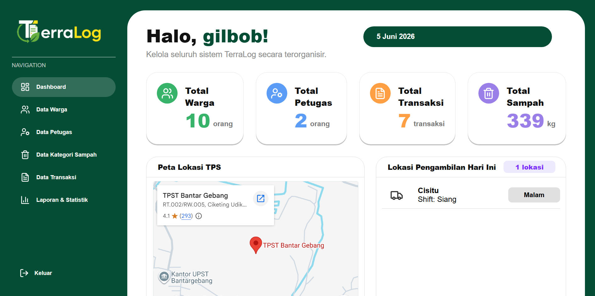
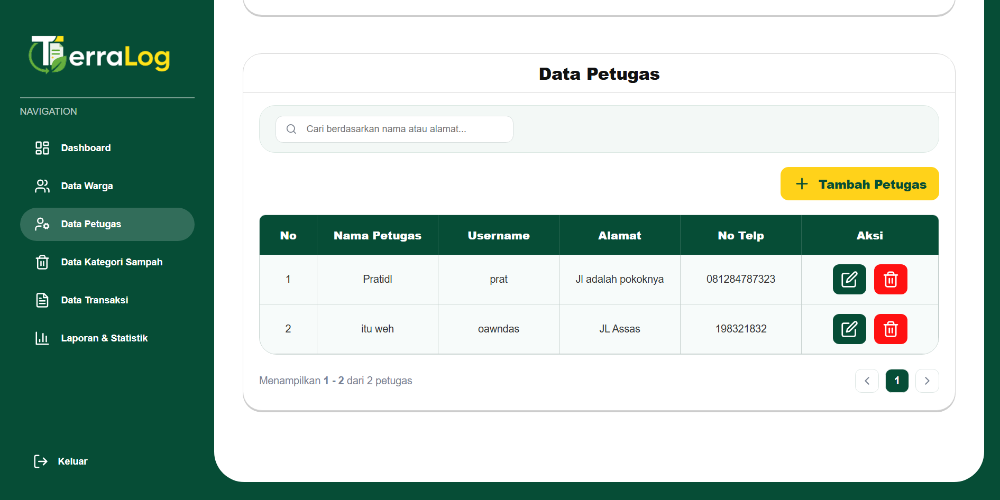
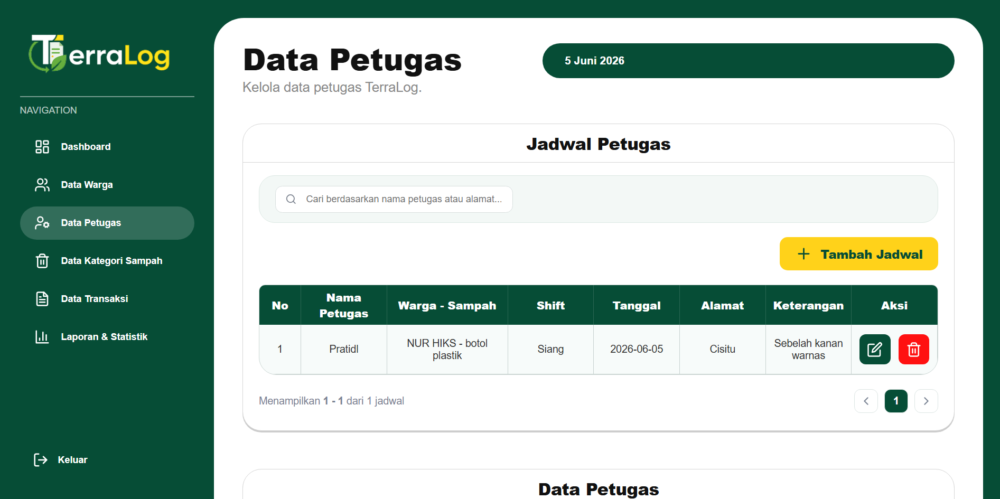
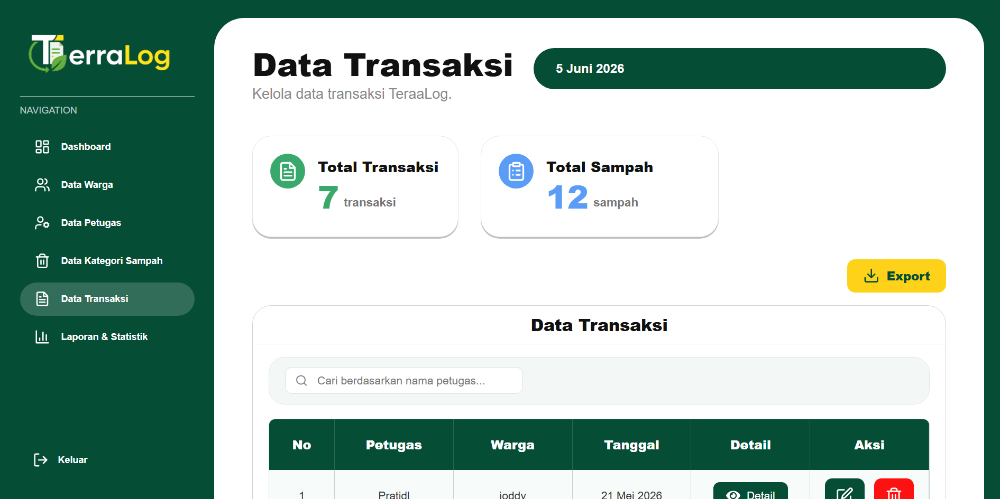
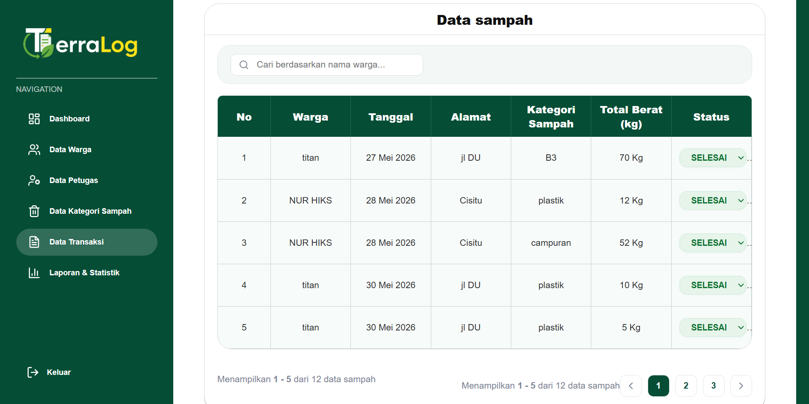
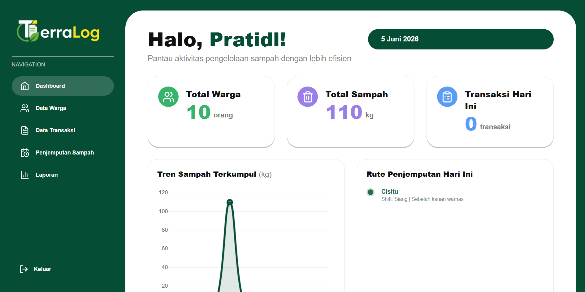
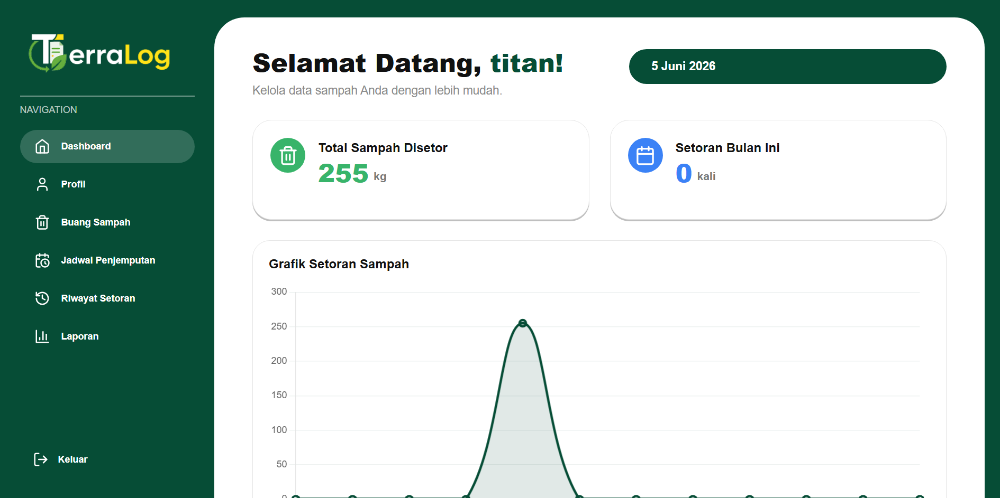
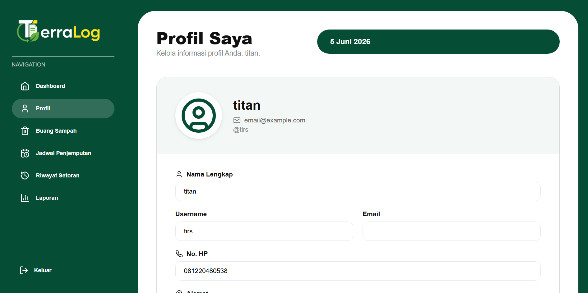

# 🌍 TerraLog - Sistem Manajemen Sampah Terpadu

TerraLog adalah aplikasi web terpadu untuk mengelola sampah secara efisien. Sistem ini dirancang untuk membantu organisasi, komunitas, dan individu dalam melacak, mengelola, dan mengoptimalkan proses penanganan sampah.

## 📋 Daftar Isi

- [Tentang Proyek](#tentang-proyek)
- [Fitur Utama](#fitur-utama)
- [Teknologi yang Digunakan](#teknologi-yang-digunakan)
- [Instalasi](#instalasi)
- [Cara Penggunaan](#cara-penggunaan)
- [Screenshots](#screenshots)
- [Struktur Proyek](#struktur-proyek)
- [Kontribusi](#kontribusi)
- [Lisensi](#lisensi)

## 🎯 Tentang Proyek

TerraLog adalah platform manajemen sampah yang komprehensif yang memungkinkan pengguna untuk:

- Mencatat dan melacak jenis-jenis sampah
- Mengelola jadwal pengumpulan sampah
- Melakukan transaksi daur ulang
- Mengelola data pengguna dan kategori sampah
- Memantau aktivitas manajemen sampah secara real-time

Aplikasi ini terdiri dari backend berbasis Spring Boot dan frontend berbasis React untuk memberikan pengalaman pengguna yang seamless.

## ✨ Fitur Utama

### Backend (Spring Boot)

- **Autentikasi & Keamanan**: Sistem keamanan dengan Spring Security
- **Manajemen Sampah**: CRUD operations untuk berbagai jenis sampah
- **Jadwal Pengumpulan**: Penjadwalan otomatis untuk pengumpulan sampah
- **Manajemen Transaksi**: Pencatatan transaksi daur ulang dan pengolahan sampah
- **Kategori Sampah**: Klasifikasi dan kategorisasi sampah
- **Manajemen Pengguna**: Sistem user management yang komprehensif
- **RESTful API**: API yang mudah diintegrasikan

### Frontend (React)

- **Dashboard Interaktif**: Visualisasi data manajemen sampah
- **User Interface Modern**: Desain responsif dan user-friendly
- **Navbar Navigasi**: Navigasi yang intuitif
- **Komponen Reusable**: Komponen React yang terstruktur

## 🛠️ Teknologi yang Digunakan

### Backend

- **Java 11+**: Bahasa pemrograman utama
- **Spring Boot**: Framework backend
- **Spring Security**: Keamanan aplikasi
- **Spring Data JPA**: ORM untuk database
- **Maven**: Build management tool

### Frontend

- **React**: Library untuk membangun UI
- **JavaScript**: Bahasa pemrograman frontend
- **CSS**: Styling komponen
- **React Router**: Routing aplikasi

### Database

- **MySQL/PostgreSQL**: Database utama (tergantung konfigurasi)

## 📦 Instalasi

### Prerequisites

- Java 11 atau lebih tinggi
- Node.js dan npm
- MySQL/PostgreSQL (atau database yang Anda gunakan)
- Maven

### Langkah Instalasi

#### 1. Clone Repository

```bash
git clone <repository-url>
cd TerraLog-main
```

#### 2. Setup Backend

```bash
# Navigate ke project root
cd .

# Build project dengan Maven
./mvnw clean install
# atau
mvn clean install

# Konfigurasi database di application.properties
# Edit src/main/resources/application.properties
```

#### 3. Setup Frontend

```bash
# Navigate ke folder frontend
cd src/main/java/com/terralog/terralog-frontend

# Install dependencies
npm install

# Jalankan development server
npm start
```

#### 4. Jalankan Aplikasi

```bash
# Terminal 1 - Jalankan Backend
./mvnw spring-boot:run
# atau
mvn spring-boot:run

# Terminal 2 - Frontend sudah berjalan di npm start
# Aplikasi akan accessible di http://localhost:3000
```

## 🚀 Cara Penggunaan

Aplikasi TerraLog memiliki tiga role pengguna dengan fitur-fitur yang berbeda sesuai dengan kebutuhan mereka.

### 👨‍💼 1. Admin

Admin memiliki akses penuh untuk mengelola seluruh sistem manajemen sampah.

**Fitur Admin:**

- **Manajemen Petugas**
  - Tambah petugas pengangkut sampah baru
  - Edit data petugas (nama, kontak, area kerja, dll)
  - Hapus petugas yang sudah tidak aktif
  - Lihat daftar lengkap semua petugas

- **Manajemen Warga**
  - Tambah data warga baru
  - Edit profil warga (alamat, kontak, RT/RW, dll)
  - Hapus data warga
  - Lihat daftar lengkap semua warga yang terdaftar

- **Manajemen Jadwal Pengangkutan**
  - Buat jadwal pengangkutan sampah baru
  - Tentukan hari dan waktu pengangkutan
  - Assign petugas ke jadwal pengangkutan
  - Edit dan hapus jadwal yang sudah ada
  - Monitor jadwal yang aktif dan akan datang

- **Approval Transaksi**
  - Review semua transaksi daur ulang yang masuk
  - Approve atau reject transaksi dari warga dan petugas
  - Lihat detail transaksi dan dokumentasi
  - Generate laporan transaksi

- **Data Sampah**
  - Lihat data lengkap sampah yang sudah dikumpulkan
  - Monitoring data sampah per kategori
  - Analisis trend pengumpulan sampah
  - Export laporan data sampah

### 👷 2. Petugas Pengangkut

Petugas adalah orang yang bertugas mengangkut dan mengelola sampah di lapangan.

**Fitur Petugas:**

- **Update Data Warga**
  - Update kontak warga yang berubah
  - Update alamat atau lokasi warga
  - Catat catatan khusus tentang warga (misalnya akses sulit, jam terbaik, dll)
  - Lihat data warga di area tugas petugas

- **Lihat Jadwal Penjemputan**
  - Lihat jadwal pengangkutan yang sudah di-assign untuk petugas
  - Detail lokasi warga yang akan dikunjungi
  - Lihat waktu penjemputan yang dijadwalkan
  - Tracking rute penjemputan

- **Melakukan Transaksi**
  - Input data sampah yang berhasil dikumpulkan
  - Catat jenis dan berat sampah dari setiap warga
  - Upload bukti foto/dokumentasi pengangkutan
  - Submit transaksi untuk di-approve admin
  - Lihat status transaksi yang telah disubmit

- **Lihat Data Sampah yang Sudah Diangkut**
  - Monitor progress pengangkutan sampah
  - Lihat total sampah yang sudah diangkut
  - Breakdown sampah per kategori
  - Laporan sampah yang sudah dikumpulkan per hari/minggu

### 👤 3. User (Warga)

User adalah warga yang memanfaatkan layanan manajemen sampah.

**Fitur User:**

- **Melakukan Buang Sampah**
  - Submit permintaan untuk membuang sampah
  - Pilih kategori jenis sampah (organik, plastik, kertas, dll)
  - Masukkan jumlah/berat sampah yang ingin dibuang
  - Upload foto sampah (opsional)
  - Konfirmasi permintaan buang sampah

- **Lihat Jadwal Penjemputan**
  - Lihat jadwal penjemputan sampah area Anda
  - Notifikasi jadwal penjemputan yang akan datang
  - Info detail petugas yang akan mengambil sampah
  - Tracking real-time ketika petugas dalam perjalanan

- **Lihat Laporan Sampah**
  - History sampah yang sudah Anda buang
  - Detail jumlah dan kategori sampah per transaksi
  - Total kontribusi sampah Anda dalam period tertentu
  - Catatan feedback dari petugas

- **Profil Warga**
  - Lihat dan edit profil pribadi Anda
  - Update alamat dan kontak

## 📸 Screenshots

### Dashboard Admin



### Halaman Manajemen Petugas



### Halaman Manajemen Jadwal Pengangkutan



### Halaman Data Transaksi & Approval



### Halaman Approval Transaksi



### Dashboard Petugas



### Dashboard User (Warga)



### Profil Warga



## 📂 Struktur Proyek

```
TerraLog-main/
├── src/
│   ├── main/
│   │   ├── java/com/terralog/
│   │   │   ├── TerralogApplication.java      # Entry point aplikasi
│   │   │   ├── config/                       # Konfigurasi (Security, Web)
│   │   │   ├── controller/                   # REST Controllers
│   │   │   ├── model/                        # Entity models
│   │   │   ├── repository/                   # Data access layer
│   │   │   └── service/                      # Business logic
│   │   ├── resources/
│   │   │   └── application.properties        # Konfigurasi aplikasi
│   │   └── terralog-frontend/                # React frontend
│   │       ├── public/
│   │       ├── src/
│   │       │   ├── components/               # React components
│   │       │   ├── assets/                   # Static assets
│   │       │   ├── App.js                    # Main App component
│   │       │   └── index.js                  # React entry point
│   │       └── package.json
│   └── test/
│       └── java/com/terralog/                # Unit tests
├── pom.xml                                   # Maven configuration
├── mvnw / mvnw.cmd                           # Maven wrapper
└── README.md                                 # File ini
```

## 🤝 Kontribusi

Kami menyambut kontribusi dari komunitas! Jika Anda ingin berkontribusi:

1. Fork repository ini
2. Buat branch fitur (`git checkout -b feature/AmazingFeature`)
3. Commit perubahan Anda (`git commit -m 'Add some AmazingFeature'`)
4. Push ke branch (`git push origin feature/AmazingFeature`)
5. Buka Pull Request

## 📄 Lisensi

Proyek ini dilisensikan di bawah MIT License - lihat file LICENSE untuk detail lebih lanjut.

---

## 📞 Kontak & Support

Jika Anda memiliki pertanyaan atau saran, silakan buat issue di repository ini atau hubungi tim development.

**Dibuat dengan ❤️ untuk masa depan yang lebih berkelanjutan**
